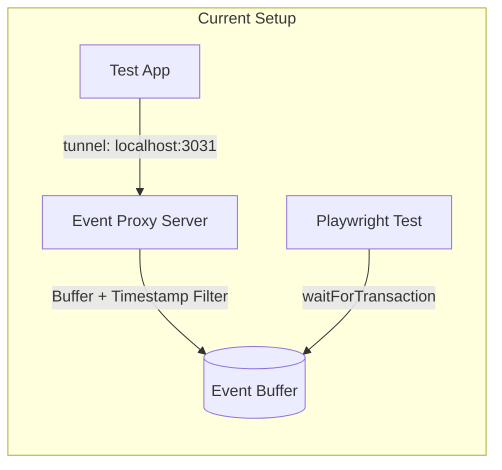
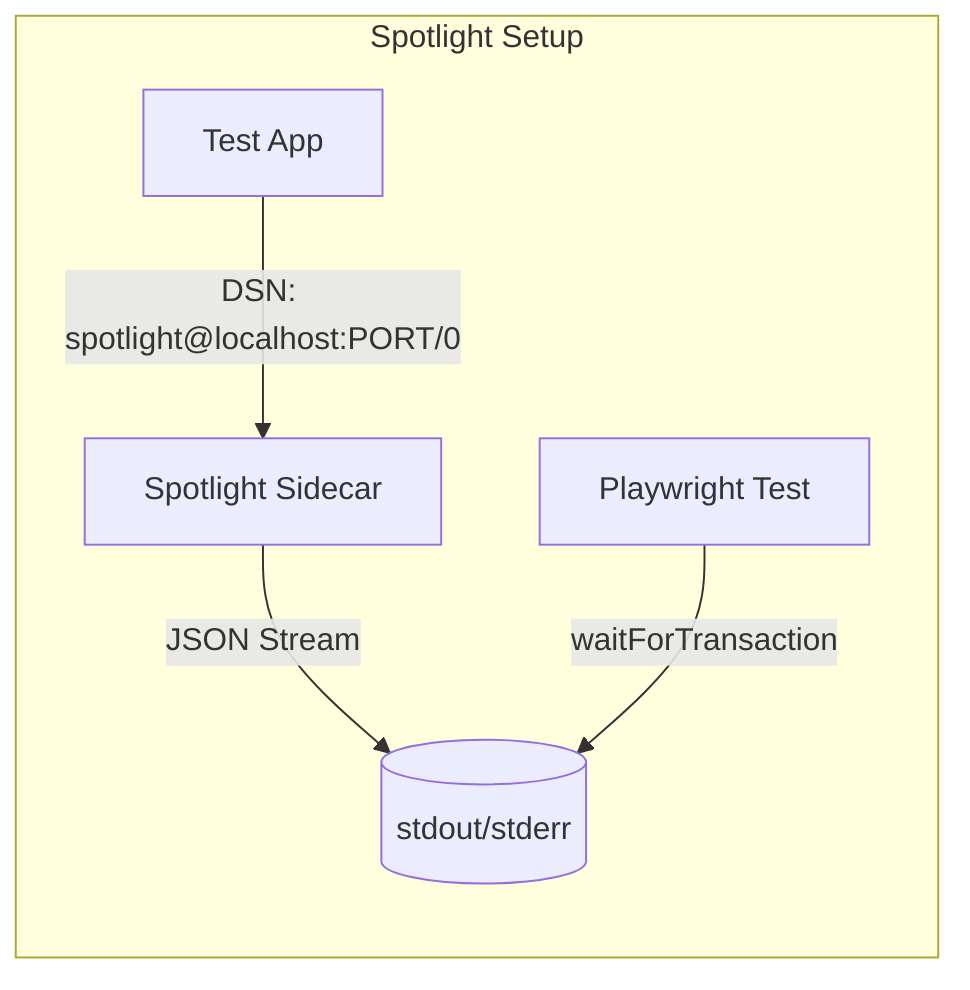

# Migrate E2E Tests from Event Proxy to Spotlight

## Current Architecture



**Problems with current approach:**

- Timestamp filtering has race conditions (stale events leak through)
- Complex buffer management with timing edge cases
- 108 test apps, ~162 files use `tunnel: localhost:3031`

## Proposed Architecture



**Benefits:**

- No timestamp filtering needed - Spotlight streams events in order
- Production-tested event handling
- Cleaner architecture with less custom code

## Implementation Plan

### Phase 1: Add Spotlight Infrastructure

1. **Add `@spotlightjs/spotlight` dependency** to [`dev-packages/test-utils/package.json`](dev-packages/test-utils/package.json)

2. **Create new Spotlight-based helpers** in [`dev-packages/test-utils/src/spotlight.ts`](dev-packages/test-utils/src/spotlight.ts):

   - `startSpotlight(options)` - Spawns `spotlight run` with dynamic port, parses port from stderr
   - `waitForSpotlightEvent(filter)` - Reads from Spotlight's JSON output stream
   - `waitForTransaction()`, `waitForError()`, etc. - High-level wrappers matching current API

3. **Update [`dev-packages/test-utils/src/playwright-config.ts`](dev-packages/test-utils/src/playwright-config.ts)**:

   - Add option to use Spotlight instead of event proxy
   - Configure webServer to run Spotlight with dynamic port
   - Pass port via environment variable to test app

### Phase 2: Create Migration Path

4. **Design backward-compatible API**:

   - Keep existing `waitForTransaction()` signature
   - New implementation reads from Spotlight instead of HTTP streaming
   - Port is passed via `SPOTLIGHT_PORT` env var

5. **Update DSN handling in test apps**:

   - Replace `tunnel: 'http://localhost:3031'` with DSN workaround
   - DSN format: `http://spotlight@localhost:${SPOTLIGHT_PORT}/0`
   - This makes SDK operate in "normal" mode (no tunnel)

### Phase 3: Migrate Test Apps (Incremental)

6. **Migration per test app involves**:

   - Remove `start-event-proxy.mjs`
   - Update `playwright.config.mjs` to use new Spotlight config
   - Update Sentry init to use DSN workaround instead of tunnel
   - No changes needed to test files (API stays the same)

7. **Start with problematic apps**:

   - `react-router-7-lazy-routes` (the failing one)
   - `react-router-7-framework`
   - Then expand to remaining ~106 apps

### Phase 4: Cleanup

8. **After all apps migrated**:

   - Remove old event proxy code from `event-proxy-server.ts`
   - Update documentation
   - Remove unused dependencies

## Key Technical Details

### Port Extraction from Spotlight

Spotlight outputs startup info to stderr. We parse it to get the dynamic port:

```
Spotlight listening on http://localhost:8969
```

### DSN Workaround Format

Per [Spotlight docs](https://spotlightjs.com/docs/cli/run/#unsupported-sdks-dsn-workaround):

```javascript
Sentry.init({
  dsn: `http://spotlight@localhost:${process.env.SPOTLIGHT_PORT}/0`
});
```

### Playwright Config Changes

```javascript
// Before
webServer: [
  { command: 'node start-event-proxy.mjs', port: 3031 },
  { command: 'yarn start', port: 3030 }
]

// After - spotlight run auto-detects and runs the app
webServer: [
  { command: 'yarn spotlight run -p 0 -f json', port: 3030 }
]
```

Note: `spotlight run` automatically:

- Detects the start script from package.json (`dev`, `develop`, `serve`, `start`)
- Starts the Spotlight sidecar on the specified port (or dynamic with `-p 0`)
- Streams events to stdout in JSON format (with `-f json`)
- Sets `SENTRY_SPOTLIGHT` env var for the child process