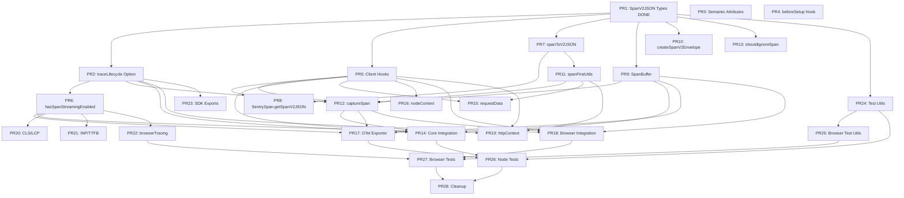

# Span Streaming PR Breakdown

This plan breaks down the span streaming refactor into 15+ incremental PRs, ordered by dependency. Each PR should be small, focused, and reviewable independently.

---

## Workflow Instructions

**Base branch:** All PRs target `lms/feat-span-first` (NOT `develop`)

**Session workflow:**

1. The user will prompt for each PR separately (e.g., "Work on PR 3")
2. Read this plan to understand the PR scope and dependencies
3. Cherry-pick or implement the changes from `lms/feat-span-streaming-poc`
4. Create a new branch from `lms/feat-span-first` for the PR
5. Use the GitHub CLI (`gh`) to create the PR against `lms/feat-span-first`

**Branch naming convention:** `lms/span-first-prN-short-description`

- Example: `lms/span-first-pr3-semantic-attributes`

**PR creation command:**

```bash
gh pr create --base lms/feat-span-first --title "feat(core): <title>" --body "..."
```

---

## Progress Tracking Instructions

**For the AI assistant across sessions:**

1. **When completing a PR task:**
   - Update the todo status in the frontmatter from `status: pending` to `status: completed`
   - In the Dependency Graph below, add `DONE` suffix to the completed node label
   - Example: Change `PR1[PR1: SpanV2JSON Types]` to `PR1[PR1: SpanV2JSON Types DONE]`
   - Update the PR Links table at the bottom with status and URL

2. **When starting a new session:**
   - Read this plan file first to understand current progress
   - Check which PRs are marked as `completed` in the frontmatter
   - Verify dependencies are merged before starting a new PR
   - The user will specify which PR to work on

3. **Before creating a PR:**
   - Ensure `lms/feat-span-first` is up to date
   - Create a new branch from `lms/feat-span-first`
   - Run `yarn lint` and `yarn build:dev` to verify changes
   - Only include files listed in the PR scope

4. **After creating a PR:**
   - Update the PR Links table with the GitHub URL
   - Mark the todo as `completed` in frontmatter
   - Add `DONE` to the node in the dependency graph

---

## PR 1: SpanV2JSON and Envelope Type Definitions

**Files:**

- [`packages/core/src/types-hoist/span.ts`](packages/core/src/types-hoist/span.ts) - Add `SpanV2JSON`, `SpanV2JSONWithSegmentRef`, `SerializedSpanContainer`
- [`packages/core/src/types-hoist/envelope.ts`](packages/core/src/types-hoist/envelope.ts) - Add `SpanContainerItemHeaders`, `SpanContainerItem`, `SpanV2EnvelopeHeaders`, `SpanV2Envelope`
- [`packages/core/src/types-hoist/link.ts`](packages/core/src/types-hoist/link.ts) - Make `SpanLinkJSON` generic for attribute types
- [`packages/core/src/types-hoist/attributes.ts`](packages/core/src/types-hoist/attributes.ts) - New file with `SerializedAttributes`, `SerializedAttribute` types
- [`packages/core/src/index.ts`](packages/core/src/index.ts) - Export new types

**Dependencies:** None (foundation PR)

---

## PR 2: traceLifecycle Option and beforeSendSpan Type Updates

**Files:**

- [`packages/core/src/types-hoist/options.ts`](packages/core/src/types-hoist/options.ts) - Add `traceLifecycle` option, `SpanV2CompatibleBeforeSendSpanCallback` type, update `beforeSendSpan` signature
- [`packages/core/src/utils/beforeSendSpan.ts`](packages/core/src/utils/beforeSendSpan.ts) - New file with `withStreamSpan` and `isV2BeforeSendSpanCallback`
- [`packages/core/src/index.ts`](packages/core/src/index.ts) - Export utilities

**Dependencies:** PR 1

---

## PR 3: Semantic Attributes for Span Streaming

**Files:**

- [`packages/core/src/semanticAttributes.ts`](packages/core/src/semanticAttributes.ts) - Add all new semantic attributes:
  - Common: `SENTRY_RELEASE`, `SENTRY_ENVIRONMENT`, `SENTRY_SEGMENT_NAME`, `SENTRY_SEGMENT_ID`, `SENTRY_SDK_NAME`, `SENTRY_SDK_VERSION`
  - User: `USER_ID`, `USER_EMAIL`, `USER_IP_ADDRESS`, `USER_USERNAME`
  - Web vitals: `LCP_*`, `CLS_*`, `INP_*`, `TTFB_*`, `FP_*`, `FCP_*`
  - Browser: `BROWSER_CONNECTION_RTT`
  - HTTP: `HTTP_REQUEST_TIME_TO_FIRST_BYTE`, `URL_QUERY`
  - `SENTRY_SPAN_SOURCE`
- [`packages/core/src/attributes.ts`](packages/core/src/attributes.ts) - Export `AttributeUnit` type

**Dependencies:** None (can be merged independently)

---

## PR 4: beforeSetup Integration Hook

**Files:**

- [`packages/core/src/types-hoist/integration.ts`](packages/core/src/types-hoist/integration.ts) - Add `beforeSetup` hook to `Integration` interface
- [`packages/core/src/integration.ts`](packages/core/src/integration.ts) - Add `beforeSetupIntegrations` function
- [`packages/core/src/client.ts`](packages/core/src/client.ts) - Call `beforeSetupIntegrations` in `_setupIntegrations`

**Dependencies:** None (can be merged independently)

---

## PR 5: Client Hooks for Span Processing

**Files:**

- [`packages/core/src/client.ts`](packages/core/src/client.ts) - Add new hooks:
  - `afterSpanEnd` - fired after spanEnd
  - `afterSegmentSpanEnd` - fired after segment span ends
  - `processSpan` - for modifying span JSON before sending
  - `processSegmentSpan` - for adding scope data to segment spans
  - `enqueueSpan` - for adding span to buffer

**Dependencies:** PR 1 (needs SpanV2JSON types)

---

## PR 6: hasSpanStreamingEnabled Utility

**Files:**

- [`packages/core/src/utils/hasSpanStreamingEnabled.ts`](packages/core/src/utils/hasSpanStreamingEnabled.ts) - New utility function
- [`packages/core/src/index.ts`](packages/core/src/index.ts) - Export utility

**Dependencies:** PR 2 (needs traceLifecycle option)

---

## PR 7: Span Serialization Utilities (spanToV2JSON)

**Files:**

- [`packages/core/src/utils/spanUtils.ts`](packages/core/src/utils/spanUtils.ts):
  - Add `spanToV2JSON` function
  - Add `getV2SpanLinks` function
  - Add `getV2StatusMessage` function
  - Rename `getRootSpan` implementation to `INTERNAL_getSegmentSpan` (alias `getRootSpan` to it)
- [`packages/core/src/index.ts`](packages/core/src/index.ts) - Export new functions

**Dependencies:** PR 1 (needs SpanV2JSON type)

---

## PR 8: SentrySpan.getSpanV2JSON Method

**Files:**

- [`packages/core/src/tracing/sentrySpan.ts`](packages/core/src/tracing/sentrySpan.ts):
  - Add `getSpanV2JSON()` method
  - Emit `afterSpanEnd` hook after `spanEnd`
  - Emit `afterSegmentSpanEnd` for segment spans in stream mode

**Dependencies:** PR 5, PR 7

---

## PR 9: SpanBuffer Class

**Files:**

- [`packages/core/src/spans/spanBuffer.ts`](packages/core/src/spans/spanBuffer.ts) - New file with `SpanBuffer` class
- [`packages/core/src/index.ts`](packages/core/src/index.ts) - Export `SpanBuffer` and `SpanBufferOptions`

**Dependencies:** PR 1 (needs envelope types)

---

## PR 10: createSpanV2Envelope Function

**Files:**

- [`packages/core/src/envelope.ts`](packages/core/src/envelope.ts) - Add `createSpanV2Envelope` function, refactor `dscHasRequiredProps`
- [`packages/core/src/index.ts`](packages/core/src/index.ts) - Export function

**Dependencies:** PR 1 (needs SpanV2Envelope type)

---

## PR 11: spanFirstUtils (Context to Attributes Conversion)

**Files:**

- [`packages/core/src/spans/spanFirstUtils.ts`](packages/core/src/spans/spanFirstUtils.ts) - New file with:
  - `safeSetSpanJSONAttributes`
  - `applyBeforeSendSpanCallback`
  - `contextsToAttributes`
- [`packages/core/src/index.ts`](packages/core/src/index.ts) - Export utilities

**Dependencies:** PR 1, PR 7

---

## PR 12: captureSpan Pipeline

**Files:**

- [`packages/core/src/spans/captureSpan.ts`](packages/core/src/spans/captureSpan.ts) - New file with `captureSpan` function
- [`packages/core/src/utils/scopeData.ts`](packages/core/src/utils/scopeData.ts) - Merge attributes in `mergeScopeData`
- [`packages/core/src/index.ts`](packages/core/src/index.ts) - Export `captureSpan`
- [`packages/core/test/lib/spans/captureSpan.test.ts`](packages/core/test/lib/spans/captureSpan.test.ts) - Unit tests

**Dependencies:** PR 2, PR 5, PR 7, PR 11

---

## PR 13: shouldIgnoreSpan and reparentChildSpans Updates

**Files:**

- [`packages/core/src/utils/should-ignore-span.ts`](packages/core/src/utils/should-ignore-span.ts) - Update to support both SpanJSON and SpanV2JSON
- [`packages/core/src/index.ts`](packages/core/src/index.ts) - Export functions

**Dependencies:** PR 1

---

## PR 14: Core spanStreamingIntegration (Server)

**Files:**

- [`packages/core/src/integrations/spanStreaming.ts`](packages/core/src/integrations/spanStreaming.ts) - New integration
- [`packages/core/src/index.ts`](packages/core/src/index.ts) - Export integration
- [`packages/core/test/lib/integrations/serverSpanStreaming.test.ts`](packages/core/test/lib/integrations/serverSpanStreaming.test.ts) - Unit tests

**Dependencies:** PR 2, PR 5, PR 9, PR 12

---

## PR 15: requestDataIntegration Span Streaming Support

**Files:**

- [`packages/core/src/integrations/requestdata.ts`](packages/core/src/integrations/requestdata.ts) - Add `processSegmentSpan` hook handler

**Dependencies:** PR 3, PR 5, PR 11

---

## PR 16: nodeContextIntegration Updates

**Files:**

- [`packages/node-core/src/integrations/context.ts`](packages/node-core/src/integrations/context.ts) - Set contexts on global scope, update span scope on spanEnd

**Dependencies:** PR 5

---

## PR 17: OpenTelemetry StreamingSpanExporter

**Files:**

- [`packages/opentelemetry/src/spanExporter.ts`](packages/opentelemetry/src/spanExporter.ts) - Add `ISentrySpanExporter` interface, export `getSpanData`
- [`packages/opentelemetry/src/streamingSpanExporter.ts`](packages/opentelemetry/src/streamingSpanExporter.ts) - New streaming exporter
- [`packages/opentelemetry/src/spanProcessor.ts`](packages/opentelemetry/src/spanProcessor.ts) - Use `StreamingSpanExporter` when traceLifecycle is 'stream'

**Dependencies:** PR 6, PR 9, PR 12

---

## PR 18: Browser spanStreamingIntegration

**Files:**

- [`packages/browser/src/integrations/spanstreaming.ts`](packages/browser/src/integrations/spanstreaming.ts) - New browser-specific integration
- [`packages/browser/src/index.ts`](packages/browser/src/index.ts) - Export integration

**Dependencies:** PR 2, PR 5, PR 9, PR 12

---

## PR 19: Browser httpContextIntegration Updates

**Files:**

- [`packages/browser/src/integrations/httpcontext.ts`](packages/browser/src/integrations/httpcontext.ts) - Add `processSegmentSpan` hook for span streaming

**Dependencies:** PR 3, PR 5, PR 6, PR 11

---

## PR 20: Browser Web Vitals as Attributes (CLS, LCP)

**Files:**

- [`packages/browser-utils/src/metrics/cls.ts`](packages/browser-utils/src/metrics/cls.ts) - Use `startInactiveSpan` with attributes
- [`packages/browser-utils/src/metrics/lcp.ts`](packages/browser-utils/src/metrics/lcp.ts) - Use `startInactiveSpan` with attributes

**Dependencies:** PR 3, PR 6

---

## PR 21: Browser Web Vitals INP and TTFB Updates

**Files:**

- [`packages/browser-utils/src/metrics/inp.ts`](packages/browser-utils/src/metrics/inp.ts) - Send INP as v2 span when streaming
- [`packages/browser-utils/src/metrics/browserMetrics.ts`](packages/browser-utils/src/metrics/browserMetrics.ts) - Set web vitals as attributes when streaming

**Dependencies:** PR 3, PR 6

---

## PR 22: browserTracingIntegration Updates

**Files:**

- [`packages/browser/src/tracing/browserTracingIntegration.ts`](packages/browser/src/tracing/browserTracingIntegration.ts):
  - Deprecate `enableStandaloneClsSpans` and `enableStandaloneLcpSpans`
  - Use `hasSpanStreamingEnabled` to determine web vital behavior

**Dependencies:** PR 6, PR 20, PR 21

---

## PR 23: SDK Re-exports (withStreamSpan)

**Files:**

- [`packages/browser/src/index.ts`](packages/browser/src/index.ts) - Export `withStreamSpan`
- [`packages/node/src/index.ts`](packages/node/src/index.ts) - Export `withStreamSpan`
- [`packages/node-core/src/index.ts`](packages/node-core/src/index.ts) - Export `withStreamSpan`
- Other SDK packages that need the export

**Dependencies:** PR 2

---

## PR 24: Test Utilities for Span V2

**Files:**

- [`dev-packages/test-utils/src/event-proxy-server.ts`](dev-packages/test-utils/src/event-proxy-server.ts) - Add `waitForSpanV2Envelope`, `waitForSpanV2`, `waitForSpansV2`
- [`dev-packages/test-utils/src/index.ts`](dev-packages/test-utils/src/index.ts) - Export utilities

**Dependencies:** PR 1

---

## PR 25: Browser Integration Test Utilities

**Files:**

- [`dev-packages/browser-integration-tests/utils/spanFirstUtils.ts`](dev-packages/browser-integration-tests/utils/spanFirstUtils.ts) - New utilities for browser tests
- [`dev-packages/browser-integration-tests/utils/helpers.ts`](dev-packages/browser-integration-tests/utils/helpers.ts) - Minor update

**Dependencies:** PR 24

---

## PR 26: Node Integration Tests for Span Streaming

**Files:**

- [`dev-packages/node-integration-tests/suites/spans/default/*`](dev-packages/node-integration-tests/suites/spans/default/) - Default span streaming tests
- [`dev-packages/node-integration-tests/suites/spans/ignoreSpans/*`](dev-packages/node-integration-tests/suites/spans/ignoreSpans/) - ignoreSpans tests
- [`dev-packages/node-integration-tests/utils/assertions.ts`](dev-packages/node-integration-tests/utils/assertions.ts) - Test assertion helpers
- [`dev-packages/node-integration-tests/utils/runner.ts`](dev-packages/node-integration-tests/utils/runner.ts) - Test runner updates

**Dependencies:** PR 14, PR 17, PR 24

---

## PR 27: Browser Integration Tests for Span Streaming

**Files:**

- [`dev-packages/browser-integration-tests/suites/span-first/*`](dev-packages/browser-integration-tests/suites/span-first/) - All span-first test suites:
  - pageload
  - error
  - linked-traces
  - measurements/connection-rtt
  - web-vitals/web-vitals-ttfb
  - backgroundtab-pageload

**Dependencies:** PR 18, PR 22, PR 25

---

## PR 28: Size Limit and Cleanup

**Files:**

- [`.size-limit.js`](.size-limit.js) - Update size limits
- [`CHANGELOG.md`](CHANGELOG.md) - Add changelog entries

**Dependencies:** All previous PRs (final cleanup)

---

## Dependency Graph

To mark a PR as complete, add "DONE" to the node label. Example: `PR1[PR1: SpanV2JSON Types DONE]`



---

## Recommended Order

**Tier 1 (Foundation - No dependencies):**

1. PR 3: Semantic Attributes
2. PR 4: beforeSetup Hook
3. PR 1: SpanV2JSON Types

**Tier 2 (Core infrastructure):**

4. PR 2: traceLifecycle Option
5. PR 5: Client Hooks
6. PR 6: hasSpanStreamingEnabled
7. PR 7: Span Serialization

**Tier 3 (Pipeline components):**

8. PR 8: SentrySpan.getSpanV2JSON
9. PR 9: SpanBuffer
10. PR 10: createSpanV2Envelope
11. PR 11: spanFirstUtils
12. PR 13: shouldIgnoreSpan updates

**Tier 4 (Core feature):**

13. PR 12: captureSpan Pipeline

**Tier 5 (Integrations):**

14. PR 14: Core spanStreamingIntegration
15. PR 15: requestDataIntegration
16. PR 16: nodeContextIntegration
17. PR 17: OpenTelemetry Exporter
18. PR 18: Browser spanStreamingIntegration
19. PR 19: httpContextIntegration

**Tier 6 (Browser metrics):**

20. PR 20: CLS/LCP as attributes
21. PR 21: INP/TTFB updates
22. PR 22: browserTracingIntegration

**Tier 7 (Exports and tests):**

23. PR 23: SDK Re-exports
24. PR 24: Test Utilities
25. PR 25: Browser Test Utilities
26. PR 26: Node Integration Tests
27. PR 27: Browser Integration Tests

**Tier 8 (Final):**

28. PR 28: Size Limits and Cleanup

---

## PR Links (update as PRs are created)

| PR | Status | Link |

|----|--------|------|

| PR 1 | completed | https://github.com/getsentry/sentry-javascript/pull/19100 |

| PR 2 | pending | |

| PR 3 | pending | |

| PR 4 | pending | |

| PR 5 | pending | |

| PR 6 | pending | |

| PR 7 | pending | |

| PR 8 | pending | |

| PR 9 | pending | |

| PR 10 | pending | |

| PR 11 | pending | |

| PR 12 | pending | |

| PR 13 | pending | |

| PR 14 | pending | |

| PR 15 | pending | |

| PR 16 | pending | |

| PR 17 | pending | |

| PR 18 | pending | |

| PR 19 | pending | |

| PR 20 | pending | |

| PR 21 | pending | |

| PR 22 | pending | |

| PR 23 | pending | |

| PR 24 | pending | |

| PR 25 | pending | |

| PR 26 | pending | |

| PR 27 | pending | |

| PR 28 | pending | |
