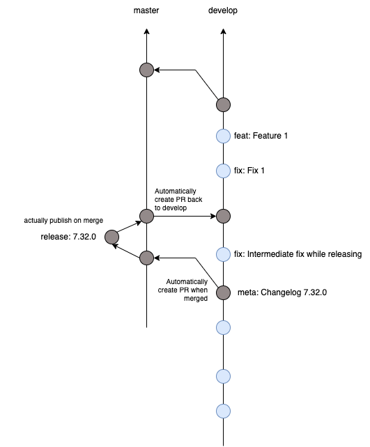

# Gitflow

We use [Gitflow](https://docs.github.com/en/get-started/quickstart/github-flow) as a branching model.

## Summary

- Ongoing work happens on the `develop` branch
- Any PRs (features, ...) are implemented as PRs against `develop`
- When we are ready to release, we merge develop into master, create a release there, then merge master back into
  develop
- Whatever is currently on `master` can be considered the last released state of the SDK
- Never merge directly into `master` (unless we want e.g. an emergency bugfix release)

## Important Caveats

While a release is pending, we may merge anything into develop, **except for changes to package.json files**. If we
change the package.json files on develop, the gitflow PR master -> develop will have merge conflicts, because during the
release the package.json files are updated on master.
