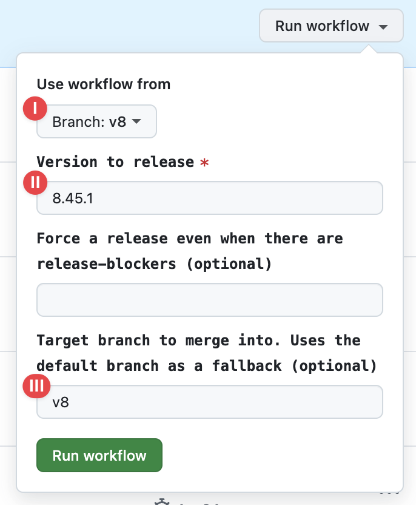

# Publishing a Release

_These steps are only relevant to Sentry employees when preparing and publishing a new SDK release._

These have also been documented via [Cursor Rules](../.cursor/rules/publishing-release.mdc).

You can run a pre-configured command in cursor by just typing `/publish_release` into the chat window to automate the steps below.

**If you want to release a new SDK for the first time, be sure to follow the
[New SDK Release Checklist](./new-sdk-release-checklist.md)**

1. Run `yarn changelog` on the `develop` branch and determine what version will be released (we use
   [semver](https://semver.org)). The semver version should be decided based on what is in included in the release. For example, if the release includes a new feature, we should increment the minor version. If it includes only bug fixes, we should increment the patch version.
2. Create a branch `prepare-release/VERSION`, eg. `prepare-release/8.1.0`, off develop
3. Update [`CHANGELOG.md`](https://github.com/getsentry/sentry-javascript/edit/master/CHANGELOG.md) to add an entry for
   the next release number and a list of changes since the last release. (See details below.)
4. Open a PR with the title `meta(changelog): Update changelog for VERSION` against `master` branch.
5. **Be cautious!** The PR against `master` should be merged via "Merge Commit"
6. When the PR is merged, it will automatically trigger the
   [Auto Prepare Release](https://github.com/getsentry/sentry-javascript/actions/workflows/auto-release.yml) on master.
7. A new issue should appear in https://github.com/getsentry/publish/issues.
8. Wait until the CI check runs have finished successfully (there is a link to them in the issue).
9. Once CI passes successfully, ask a member of the
   [@getsentry/releases-approvers](https://github.com/orgs/getsentry/teams/release-approvers) to approve the release. a.
   Once the release is completed, a sync from `master` ->` develop` will be automatically triggered

## Publishing a release for previous majors or prerelease (alpha, beta) versions

1. Run `yarn changelog` on a previous major branch (e.g. `v8` or `9.7.0-alpha`) and determine what version will be released (we use
   [semver](https://semver.org))
2. Create a branch, e.g. `changelog-8.45.1`, off a previous major branch (e.g. `v8`)
3. Update `CHANGELOG.md` to add an entry for the next release number and a list of changes since the
   last release. (See details below.)
4. Open a PR with the title `meta(changelog): Update changelog for VERSION` against the previous major branch (e.g. `v8`).
5. **Be cautious!** The PR against the previous major branch should be merged via "Squash and Merge"
   (as the commits already exist on this branch).
6. Once the PR is merged, open the [Prepare Release workflow](https://github.com/getsentry/sentry-javascript/actions/workflows/release.yml) and
   fill in 
   1. The major branch you want to release for, e.g. `v8` or `9.7.0-alpha`
   2. The version you want to release, e.g. `8.45.1` `9.7.0-alpha.1`
   3. The major branch to merge into, e.g. `v8` `9.7.0-alpha`
7. Run the release workflow

## Updating the Changelog

1. Run `yarn changelog` (or `yarn generate-changelog` for best-effort formatting) and copy everything.
2. Create a new section in the changelog with the previously determined version number.
3. Paste in the logs you copied earlier.
4. If there are any important features or fixes, highlight them under the `Important Changes` subheading. If there are no important changes, don't include this section. If the `Important Changes` subheading is used, put all other user-facing changes under the `Other Changes` subheading.
5. Any changes that are purely internal (e.g. internal refactors (`ref`) without user-facing changes, tests, chores, etc) should be put under a `<details>` block, where the `<summary>` heading is "Internal Changes" (see example).
   - Sometimes, there might be user-facing changes that are marked as `ref`, `chore` or similar - these should go in the main changelog body, not in the internal changes section.
6. Make sure the changelog entries are ordered alphabetically.
7. If any of the PRs are from external contributors, include underneath the commits
   `Work in this release contributed by <list of external contributors' GitHub usernames>. Thank you for your contributions!`.
   If there's only one external PR, don't forget to remove the final `s`. If there are three or more, use an Oxford
   comma. (It's in the Sentry styleguide!)
   - We have a GitHub Action "External Contributors" which collects all external contributors in the changelog section
     "Unreleased". The GitHub Action creates a PR with this change every time a PR of an external contributor is merged.
     You can safely cut and paste this line to the new release section of the changelog (but a sanity check is never
     wrong).
8. Commit, push, and continue with step 4 from the previous section with the general instructions (above).

### Example Changelog Entry

This is an example of a changelog entry for a release.

```md
## 9.28.0

### Important Changes

- **feat(nestjs): Stop creating spans for `TracingInterceptor` ([#16501](https://github.com/getsentry/sentry-javascript/pull/16501))**

With this change we stop creating spans for `TracingInterceptor` as this interceptor only serves as an internal helper and adds noise for the user.

- **feat(node): Update vercel ai spans as per new conventions ([#16497](https://github.com/getsentry/sentry-javascript/pull/16497))**

This feature ships updates to the span names and ops to better match OpenTelemetry. This should make them more easily accessible to the new agents module view we are building.

### Other Changes

- fix(sveltekit): Export `vercelAIIntegration` from `@sentry/node` ([#16496](https://github.com/getsentry/sentry-javascript/pull/16496))

<details>
  <summary> <strong>Internal Changes</strong> </summary>

- ref(node): Split up incoming & outgoing http handling ([#17358](https://github.com/getsentry/sentry-javascript/pull/17358))
- test(node): Enable additionalDependencies in integration runner ([#17361](https://github.com/getsentry/sentry-javascript/pull/17361))

</details>

Work in this release was contributed by @agrattan0820. Thank you for your contribution!
```
