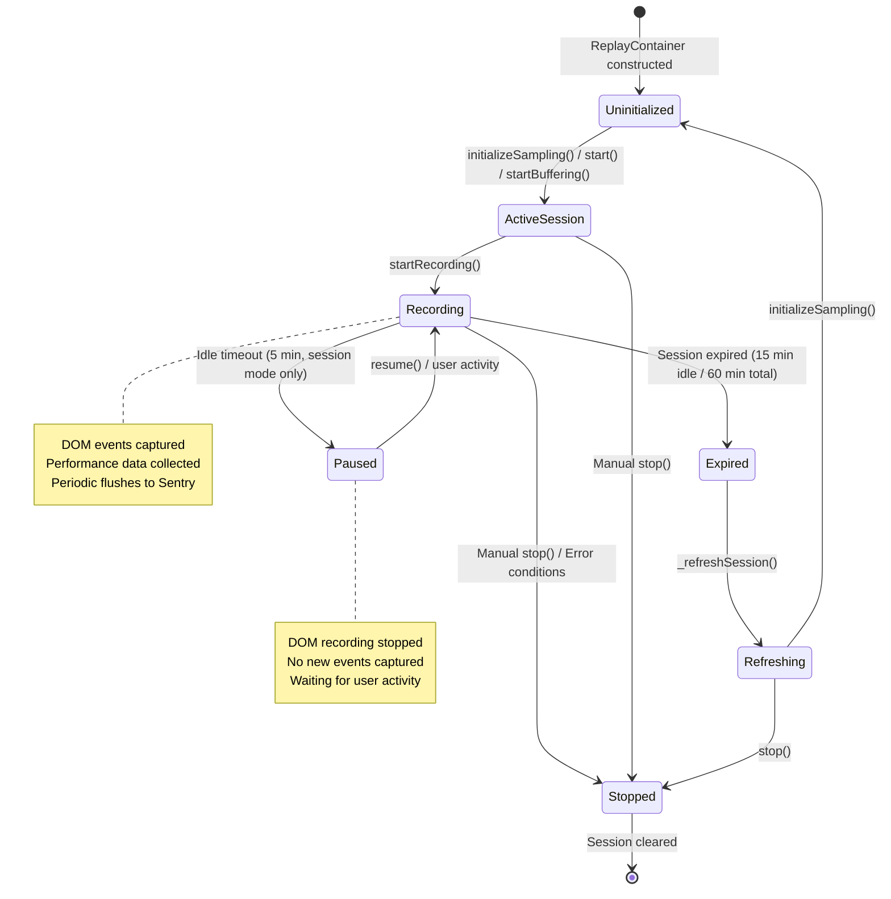
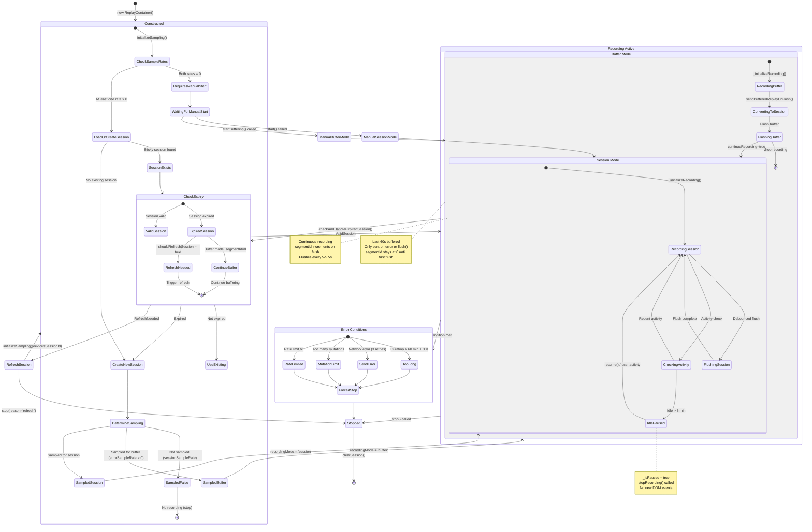
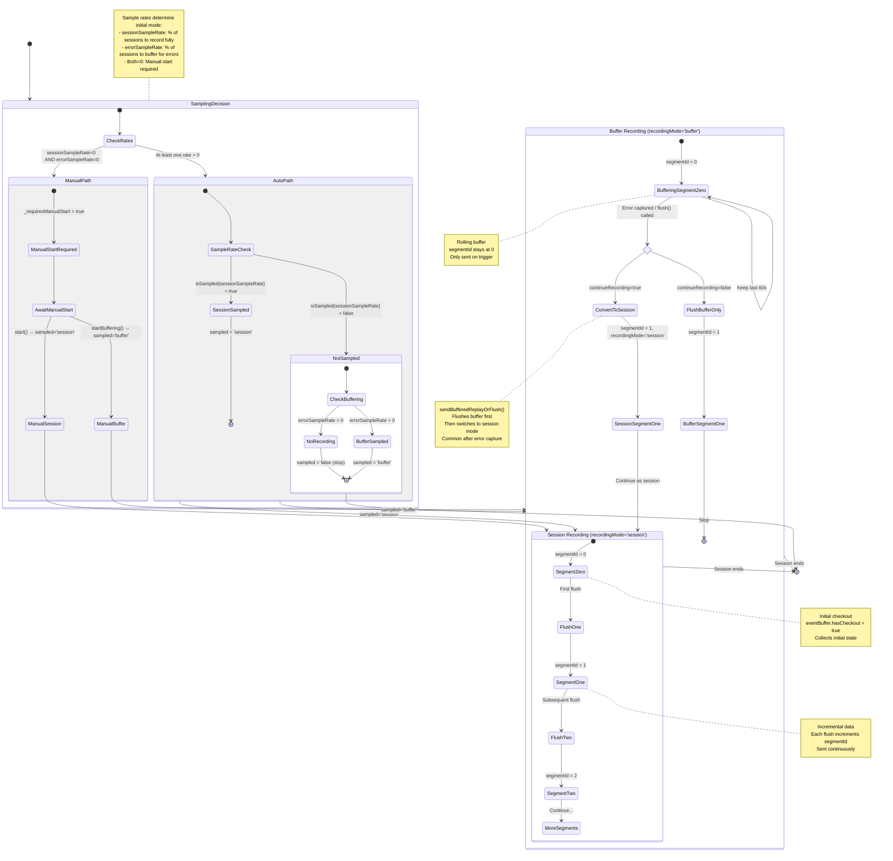

# Session State Diagrams for Replay Integration

This document provides three Mermaid state diagrams that visualize the Session lifecycle in the Replay integration (`packages/replay-internal/src/replay.ts`). Each diagram offers a different level of detail to help understand how sessions are created, managed, and terminated throughout the replay recording process.

## Purpose

These diagrams help developers understand:
- How replay sessions are initialized and sampled
- The relationship between Session objects and ReplayContainer states
- State transitions triggered by user activity, timeouts, and errors
- The difference between "session" and "buffer" recording modes

## Key Concepts

### Session
A Session represents a single replay recording instance. It contains:
- `id`: Unique session identifier
- `sampled`: Recording mode (`false` = not sampled, `'session'` = full recording, `'buffer'` = error-only recording)
- `segmentId`: Counter for replay segments sent to Sentry (starts at 0)
- `started`: Session start timestamp
- `lastActivity`: Most recent activity timestamp

### Recording Modes
- **Session mode** (`recordingMode: 'session'`): Records continuously and sends data at regular intervals
- **Buffer mode** (`recordingMode: 'buffer'`): Records last 60 seconds only, sent when an error occurs or `flush()` is called

### Container States
The `ReplayContainer` manages the session lifecycle with these key flags:
- `_isEnabled`: Whether the integration is active
- `_isPaused`: Whether DOM recording is paused
- `_requiresManualStart`: Whether recording needs manual initialization

---

## Diagram A: High-Level Session Lifecycle

This diagram shows the core session lifecycle without implementation details, focusing on major states and transitions.



---

## Diagram B: Detailed State Machine

This comprehensive diagram shows all states, transitions, and error conditions including the relationship between Session sampling states and Container states.



---

## Diagram C: Sampling and Recording Modes Focus

This diagram emphasizes the sampling decision tree and how recording modes are determined and can transition.



---

## Notes and Reference

### Timeout Durations

From `constants.ts`:
- `SESSION_IDLE_PAUSE_DURATION`: 300,000ms (5 minutes) - After this idle time, recording pauses (session mode only)
- `SESSION_IDLE_EXPIRE_DURATION`: 900,000ms (15 minutes) - After this idle time, session expires and refreshes
- `MAX_REPLAY_DURATION`: 3,600,000ms (60 minutes) - Maximum total session length
- `BUFFER_CHECKOUT_TIME`: 60,000ms (60 seconds) - Buffer recording checkout interval

### Key Methods

#### Initialization Methods
- **`initializeSampling(previousSessionId?)`** (lines 317-353)
  - Called automatically in constructor if any sample rate > 0
  - Loads or creates session based on sample rates
  - Sets `recordingMode` based on `session.sampled` value

- **`start()`** (lines 362-398)
  - Manually starts recording in session mode
  - Always creates a new session with `sampled: 'session'`
  - Sets `recordingMode = 'session'`

- **`startBuffering()`** (lines 404-428)
  - Manually starts recording in buffer mode
  - Creates session with `sampled: 'buffer'`
  - Sets `recordingMode = 'buffer'`

#### State Management Methods
- **`startRecording()`** (lines 435-472)
  - Calls rrweb's `record()` function
  - Starts DOM recording with appropriate checkout time
  - Sets `_stopRecording` function reference

- **`stopRecording()`** (lines 480-492)
  - Stops the rrweb recording
  - Clears `_stopRecording` reference
  - Does not clear session

- **`pause()`** (lines 543-552)
  - Sets `_isPaused = true`
  - Stops DOM recording
  - Session remains active

- **`resume()`** (lines 560-569)
  - Sets `_isPaused = false`
  - Restarts DOM recording (new checkout)
  - Checks session validity first

- **`stop({forceFlush?, reason?})`** (lines 498-536)
  - Sets `_isEnabled = false`
  - Removes all listeners
  - Optionally flushes remaining data
  - Clears session from storage

#### Session Lifecycle Methods
- **`checkAndHandleExpiredSession()`** (lines 742-769)
  - Checks if session should pause due to inactivity
  - Checks if session is expired
  - Automatically refreshes expired sessions
  - Returns false if session expired

- **`_refreshSession(session)`** (lines 925-931)
  - Stops current recording without forcing flush
  - Calls `initializeSampling(session.id)` with previous session ID
  - Creates new session with same sampling logic

- **`sendBufferedReplayOrFlush({continueRecording?})`** (lines 578-615)
  - Converts buffer mode to session mode
  - Flushes buffered data first
  - Optionally continues in session mode
  - Typically called after error capture

### Relationship Between `session.sampled` and `recordingMode`

The `session.sampled` property is set once during session creation and determines the initial recording behavior:

| `session.sampled` | Initial `recordingMode` | Behavior |
|-------------------|------------------------|----------|
| `false` | N/A (not recording) | Session not sampled, integration stops |
| `'buffer'` | `'buffer'` | Records last 60s, can convert to session mode |
| `'session'` | `'session'` | Records continuously from start |

**Important**: When a session is sampled for buffer mode but has already sent data (`segmentId > 0`), it will initialize in session mode on page reload to maintain consistency.

```typescript
// From initializeSampling() lines 348-349
this.recordingMode =
  this.session.sampled === 'buffer' && this.session.segmentId === 0
    ? 'buffer'
    : 'session';
```

### Activity Tracking

User activity updates both:
1. `_lastActivity` - Timestamp that persists across session lifespans
2. `session.lastActivity` - Timestamp stored in the session object

Methods that update activity:
- `triggerUserActivity()` - Updates timestamps and resumes recording if paused
- `updateUserActivity()` - Updates timestamps only (for low-value events like keydown)
- `_updateUserActivity(timestamp?)` - Internal method to set `_lastActivity`
- `_updateSessionActivity(timestamp?)` - Internal method to set `session.lastActivity`

### Error Conditions Leading to Stop

Recording can be forcefully stopped due to:
1. **Mutation limit exceeded** (line 1354-1358) - `stop({reason: 'mutationLimit', forceFlush: session mode})`
2. **Rate limiting** (line 1220) - `stop({reason: 'sendReplay'})` + recorded as dropped event
3. **Send errors after 3 retries** (line 1215) - `stop({reason: 'sendReplay'})`
4. **Session too long** (line 1187) - Throws error during flush if duration > 60 min + 30s buffer

### Segment ID Progression

The `segmentId` counter tracks how many replay segments have been sent:
- Starts at 0 when session is created
- Incremented before each flush (line 1192): `const segmentId = this.session.segmentId++`
- Stays at 0 in buffer mode until first flush
- Used by backend to reconstruct replay timeline
- Preserved in sticky sessions across page reloads

---

## Related Files

- **Main implementation**: `packages/replay-internal/src/replay.ts`
- **Session interface**: `packages/replay-internal/src/types/replay.ts` (lines 358-386)
- **Session utilities**:
  - `packages/replay-internal/src/session/loadOrCreateSession.ts`
  - `packages/replay-internal/src/session/createSession.ts`
  - `packages/replay-internal/src/session/shouldRefreshSession.ts`
  - `packages/replay-internal/src/session/clearSession.ts`
  - `packages/replay-internal/src/session/saveSession.ts`
- **Constants**: `packages/replay-internal/src/constants.ts`

