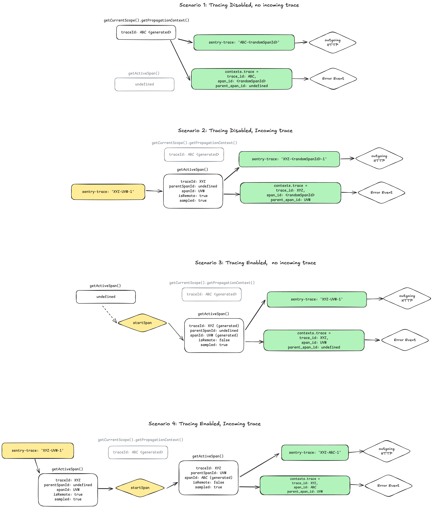

# How Trace Propagation Works in the JavaScript SDKs

Trace propagation describes how and when traceId & spanId are set and send for various types of events.
How this behaves varies a bit from Browser to Node SDKs.

## Node SDKs (OpenTelemetry based)

In the Node SDK and related OpenTelemetry-based SDKs, trace propagation works as follows:

## Browser/Other SDKs

TODO
